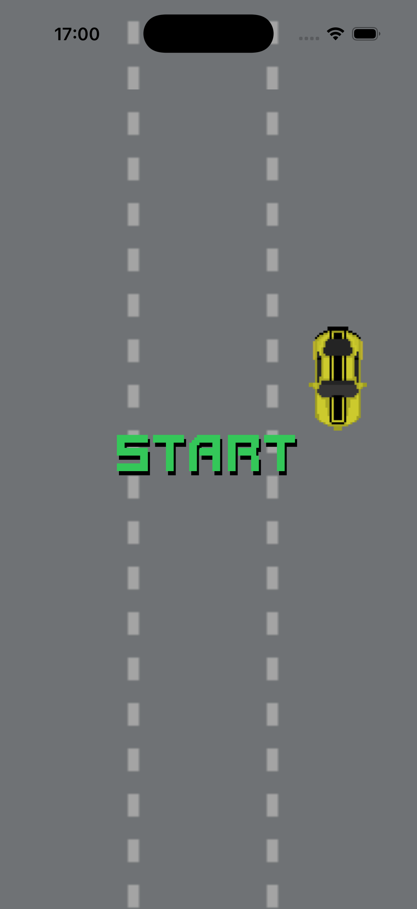
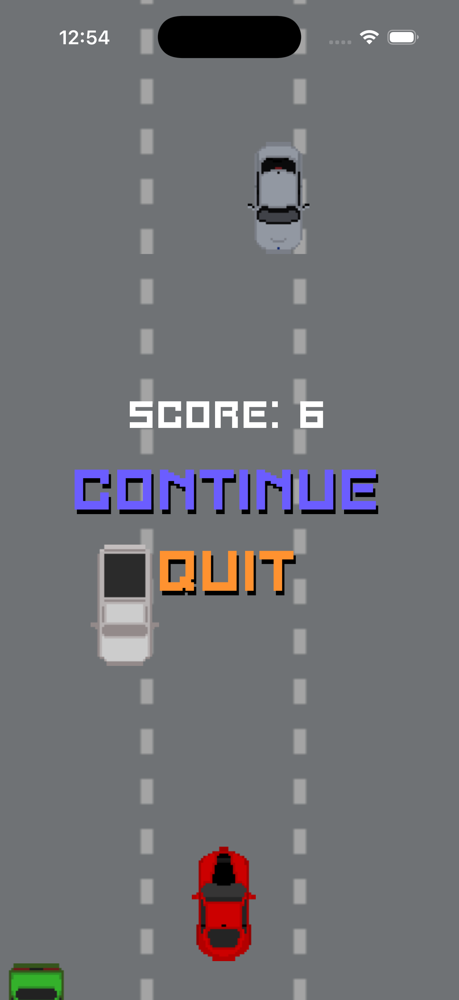
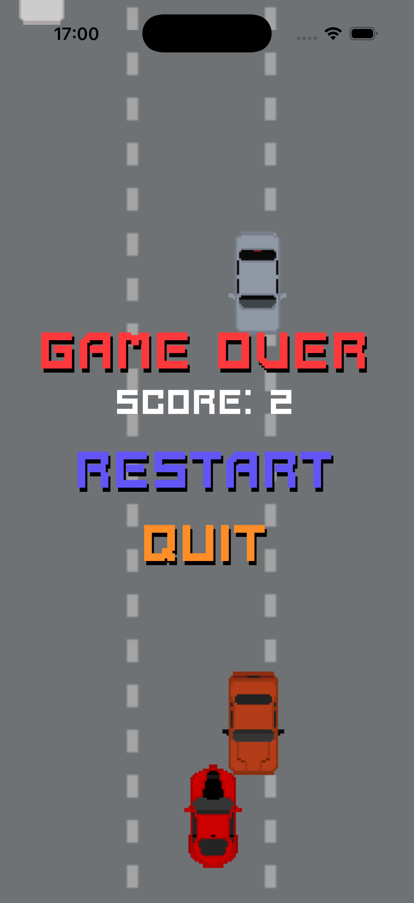
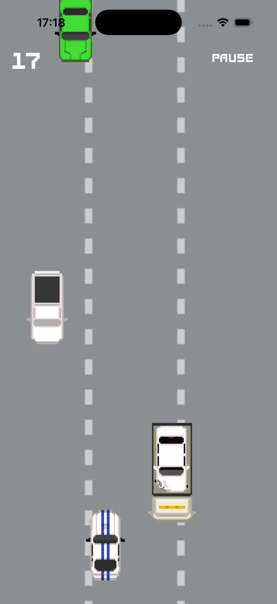
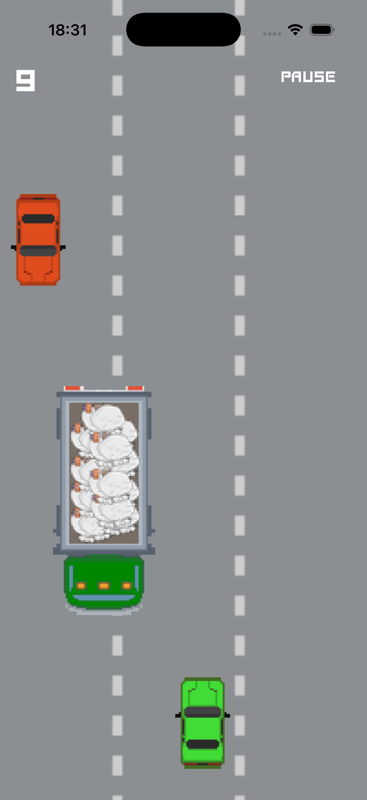
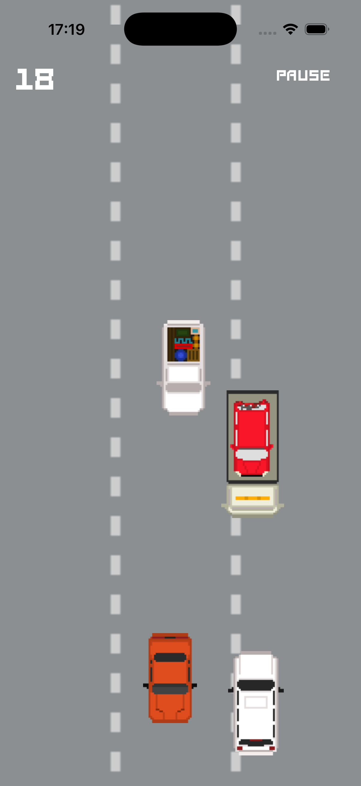

# Traffic Racer Game

## Описание

Traffic Racer Game — это учебный проект, представляющий собой простую аркадную игру для iOS. Игрок управляет машинкой, которая движется по дороге, уворачиваясь от машин движущихся на встречу. Машинки противнков и игрока генируруются случайным образом.

## Задача

### Цель игры

Игрок управляет машинкой, которая находится внизу экрана. Сверху падают препятствия, и задача игрока — уворачиваться от них, перемещая машинку влево и вправо.

Игра длится до первого столкновения.

### Основная механика

1. **Машинка игрока**
   - Машинка фиксирована по вертикали (находится внизу экрана)
   - Управление осуществляется кнопками «влево» и «вправо»

2. **Препятствия**
   - Препятствия появляются сверху экрана и падают вниз
   - Со временем скорость падения препятствий увеличивается

3. **Условие завершения**
   - Если машинка сталкивается с препятствием → игра заканчивается

4. **Счет игрока**
   - За каждое успешно пройденное препятствие игроку начисляется 1 очко
   - Счет показывается на экране

## Стек технологий

### Архитектура и паттерны
- **MVC (Model-View-Controller)** — архитектурный паттерн
- **Delegate Pattern** — для коммуникации между компонентами
- **Protocol-Oriented Programming** — использование протоколов для абстракции

### Технические решения
- **CADisplayLink** — для реализации игрового цикла с синхронизацией с частотой обновления экрана
- **Timer** — для периодического появления препятствий
- **Custom Views** — кастомные компоненты интерфейса (BackgroundView, CarView, ControlView)
- **Auto Layout** — для адаптивной верстки интерфейса

### Структура проекта
- **GameLoop** — модуль управления игровым циклом
- **ViewControllers** — контроллеры представления (GameViewController, ActionAlertViewController)
- **Views** — кастомные view компоненты и протоколы
- **Resources** — ресурсы приложения (изображения, шрифты)

## Скриншоты

<table>
  <tr>
    <td style="border: none;"></td>
    <td style="border: none;"></td>
    <td style="border: none;"></td>
  </tr>
  <tr>
    <td style="border: none;"></td>
    <td style="border: none;"></td>
    <td style="border: none;"></td>
  </tr>
</table>

